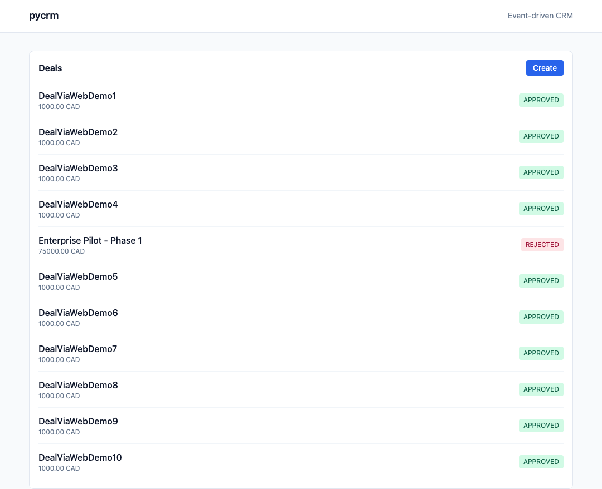
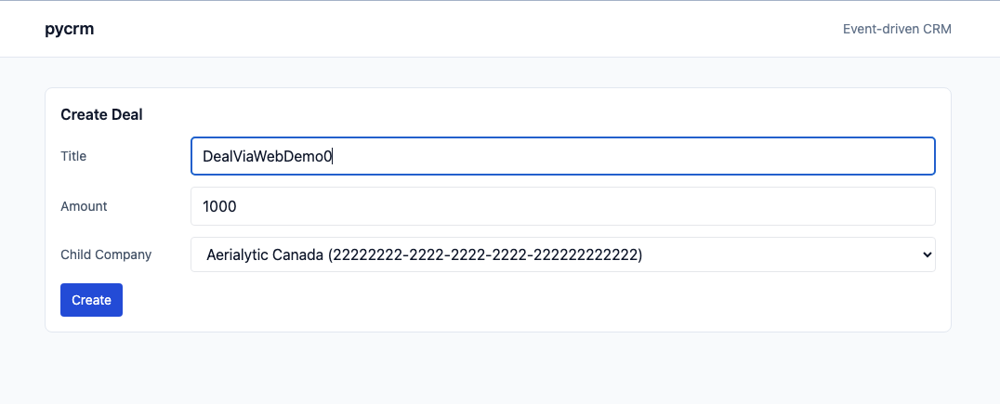
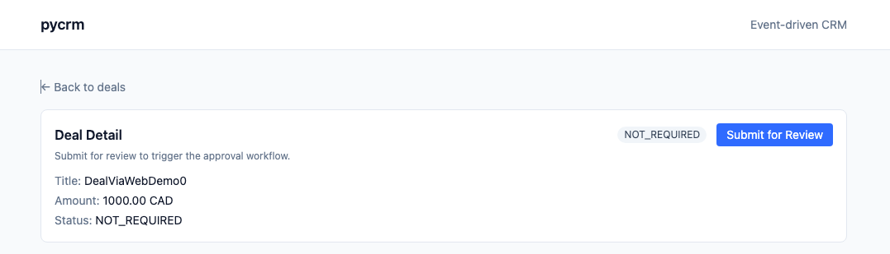
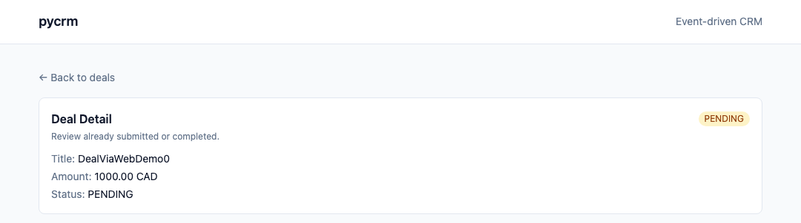
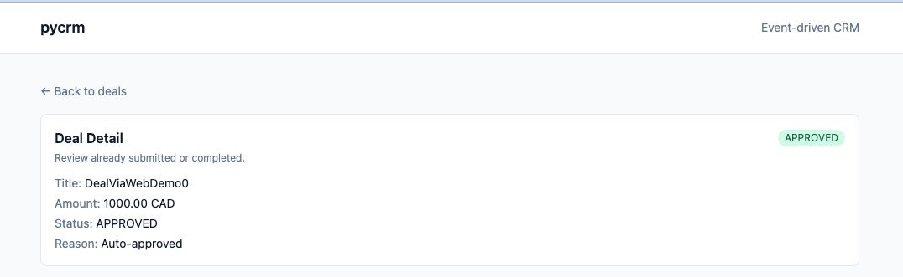

# pycrm

This project demonstrates a **multi-service, event-driven CRM system** built with:

* **Python (Django + Graphene)** for business services
* **Apollo Federation Gateway (Node.js)** for API aggregation
* **Kafka (Redpanda)** for asynchronous deal review
* **React + TypeScript + Tailwind + Apollo Client** for the frontend
* **PostgreSQL** as the primary datastore






The system showcases:

* GraphQL Federation (multiple subgraphs composed behind a single gateway)
* Asynchronous processing with Kafka
* Idempotent event consumption
* Multi-tenant authorization via user context
* Full UUID consistency across DB + ORM + services

---

# Architecture Overview

```
Frontend (React + Apollo Client)
            │
            ▼
Apollo Gateway (:4000)
            │
 ┌──────────┴──────────┐
 ▼                     ▼
org-service         crm-service
(Users/Companies)   (Deals + Kafka publish)
                            │
                            ▼
                       Kafka (Redpanda)
                            │
                            ▼
                      review-worker
                 (asynchronous approval)
                            │
                            ▼
                       PostgreSQL
```

---

# Structure

```
frontend/
  web/                 # React + TS + Tailwind + Apollo Client

backend/
  org-service/         # Company/User + authorization data (Python)
  crm-service/         # Deal lifecycle + Kafka producer (Python)
  review-worker/       # Kafka consumer for deal review (Python)
  gateway/             # Apollo Federation Gateway (Node)

docker-compose.yml     # One-command orchestration
```

---

# Services

## org-service

* Manages:

  * Companies (parent + child)
  * Users (roles, tenant)
* Provides:

  * `me` query (based on `x-user-id`)
  * Authorization context (allowed company IDs)

## crm-service

* Manages:

  * Deals
* Mutations:

  * `createDeal`
  * `submitDealForReview`
* Emits Kafka event:

  * `deal.review.requested`
* Enforces:

  * Tenant isolation
  * Role-based write access

## review-worker

* Kafka consumer
* Idempotent via `crm.processed_events`
* Applies simple scoring rule:

  * amount < 10000 → APPROVED
  * otherwise → REJECTED
* Updates:

  * review_status
  * review_score
  * review_reason
  * version
* Retry strategy (code-level):

  * In-process retry with backoff (`REVIEW_WORKER_MAX_RETRIES`, `REVIEW_WORKER_RETRY_BACKOFF_SEC`)
  * Manual Kafka commit after success/final failure
  * Failures recorded in `crm.processed_events` with error for observability

## gateway

* Apollo Federation Gateway
* Composes `org` and `crm` subgraphs
* Forwards `x-user-id` header to downstream services

## frontend

* React + TypeScript
* Apollo Client
* Polling for asynchronous state updates
* Displays:

  * Deal list
  * Create deal page
  * Deal detail page (status badge + submit action)
  * Review status transitions

---

# Quick Start

## 1️⃣ Start everything

```bash
docker compose up --build
```

## 2️⃣ Open UI

```
http://localhost:3000
```

UI pages:

* `#/deals` — Deal list
* `#/create` — Create deal
* `#/deal/:id` — Deal detail

UI flow (simplified):

```
Deals List (#/deals)
   ├─ Create → Create Deal (#/create) → Submit → Deal Detail (#/deal/:id)
   └─ Select Deal → Deal Detail (#/deal/:id)
```

---

# Nx Workspace

This repo is also wired as a minimal Nx workspace for convenience. You can use Nx to
start individual services (via Docker Compose) and run the CRM unit tests.

Install Nx (one-time):

```bash
npm install
```

Common commands (run from repo root):

```bash
# Full stack
npx nx run stack:up
npx nx run stack:down

# Services
npx nx run org-service:serve
npx nx run crm-service:serve
npx nx run review-worker:serve
npx nx run gateway:serve
npx nx run web:serve

# Tests
npx nx run crm-service:test
```

Nx does not change the runtime behavior; it simply wraps the existing Docker Compose commands.

---

# Manual API Verification (Gateway – :4000)

All requests must include:

```
x-user-id: bbbbbbbb-bbbb-bbbb-bbbb-bbbbbbbbbbbb
```

---

## 1) Verify authentication context

```bash
curl 'http://localhost:4000/graphql' \
  -H 'content-type: application/json' \
  -H 'x-user-id: bbbbbbbb-bbbb-bbbb-bbbb-bbbbbbbbbbbb' \
  --data-raw '{"query":"query { me { id email role companyId } }"}'
```

Expected: returns SALES user in CA child company.

---

## 2) Create a Deal

```bash
curl 'http://localhost:4000/graphql' \
  -H 'content-type: application/json' \
  -H 'x-user-id: bbbbbbbb-bbbb-bbbb-bbbb-bbbbbbbbbbbb' \
  --data-raw '{"query":"mutation { createDeal(title:\"DemoDeal\", amount:9000, currency:\"CAD\", childCompanyId:\"22222222-2222-2222-2222-222222222222\", createdByUserId:\"bbbbbbbb-bbbb-bbbb-bbbb-bbbbbbbbbbbb\") { id reviewStatus stage } }"}'
```

Expected:

```
reviewStatus: NOT_REQUIRED
stage: DRAFT
```

---

## 3) Submit for Review (Asynchronous)

```bash
curl 'http://localhost:4000/graphql' \
  -H 'content-type: application/json' \
  -H 'x-user-id: bbbbbbbb-bbbb-bbbb-bbbb-bbbbbbbbbbbb' \
  --data-raw '{"query":"mutation { submitDealForReview(dealId:\"<DEAL_ID>\") { id reviewStatus stage } }"}'
```

Immediate expected response:

```
reviewStatus: PENDING
stage: SUBMITTED
```

---

## 4) Poll for Final Status

```bash
curl 'http://localhost:4000/graphql' \
  -H 'content-type: application/json' \
  -H 'x-user-id: bbbbbbbb-bbbb-bbbb-bbbb-bbbbbbbbbbbb' \
  --data-raw '{"query":"query { deal(id:\"<DEAL_ID>\") { id reviewStatus reviewScore reviewReason } }"}'
```

After a few seconds:

* If amount < 10000 → `APPROVED`
* Otherwise → `REJECTED`

---

# Key Design Decisions

## 1️⃣ Why GraphQL Federation?

* Frontend talks to **one endpoint only**
* Gateway composes multiple domain services
* Clean separation of org domain and crm domain

Python currently lacks a production-grade federation gateway, so Apollo Gateway (Node) is used.

---

## 2️⃣ Why Asynchronous Review?

* Review logic simulates external approval system
* Demonstrates:

  * Event publishing
  * Consumer group
  * Idempotency
  * Event-driven state transitions

---

## 3️⃣ Idempotency Strategy

`crm.processed_events` table ensures:

* Same event ID is not processed twice
* Safe retry behavior

---

## 4️⃣ UUID Consistency

All services use:

* PostgreSQL UUID
* SQLAlchemy `UUID(as_uuid=True)`
* Explicit `uuid.UUID()` conversion in resolvers/workers

This avoids type mismatch issues (`uuid = varchar`).

---

## 5️⃣ Multi-Tenant Authorization

* Tenant boundary enforced by `company_id`
* `org-service` resolves allowed company IDs
* `crm-service` checks write permissions before mutation

Auth is simulated using:

```
x-user-id
```

In production, this would be replaced with JWT verification.

---

# Observability

Useful logs:

```bash
docker compose logs -f gateway
docker compose logs -f crm-service
docker compose logs -f review-worker
```

---

# Testing (Current + Next)

Current:

* `crm-service` has unit tests for authorization logic (`get_allowed_company_ids`, `ensure_can_write`).
* `review-worker` has unit tests for the review decision rule (APPROVED/REJECTED threshold).

Next to test:

* GraphQL mutation permissions (e.g. `createDeal`, `submitDealForReview`) with role/tenant boundaries.
* Review-worker idempotency (duplicate event IDs should not reprocess).
* End-to-end async flow: submit → PENDING → APPROVED/REJECTED with UI polling.

---

# Environment

See `.env.example` for configurable ports and service URLs.

---

# Production Hardening (Not Implemented but Designed For)

* JWT authentication
* Dead-letter queue
* Retry strategy
* Outbox pattern for reliable publishing
* Metrics + tracing
* Circuit breaker
* Schema registry for event contracts

---

# Summary

This scaffold demonstrates:

* Multi-service GraphQL Federation
* Event-driven asynchronous processing
* Idempotent Kafka consumer
* Tenant-aware authorization
* Full-stack integration (React → Gateway → Services → Kafka → DB)
